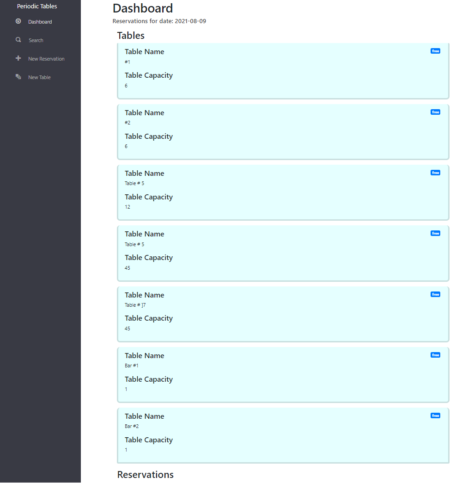

# Thinkful Capstone: Restaurant Reservation System

## Deployed Application

> https://restaurant-res-front-end1.vercel.app/dashboard

I deployed the Frontend portion using Vercel and Backend portion using Heroku.

## Overview

Periodic Tables is designed to help restaurants manage reservations and tables and keep track of customer data on an easy-to-use platform. Users can create and edit reservations, create tables, assign reservations to tables, and search for reservations by a customer's phone number. This basic functionality alleviates a restaurant's need to keep paper documentation of reservations and table availability, by automating these processes. This ensures better management of reservations and keeps a digital record of all information so nothing is lost or forgotten.

## API

### /Dashboard

When loading the url, you will be directed to the dashboard of the application which will default to displaying the tables and current reservations for current date.

>

### /reservations/new

When clicking on "New Reservation" menu item, you will be directed to a page that displays the form to complete to create a new reservation that will post to the dashboard page.

>

### /reservations/:reservation_id/edit

When clicking the "edit" button on a reservation, you will be directed to an "Edit Reservation" form which will load the reservation's information where it can be edited, saved, or cancelled.

>

### /reservations/:reservation_id/seat

When clicking the "seat" button on a reservation, you will be directed to a page to choose a table to seat selected reservation at.

When submitting, you will be directed back to dashboard that has updated to show the reservation with status "seated" and selected table with status "occupied". "Finish" button will also be displayed.

After a reservation has finished, you can choose "finish" to change the status of the table to "free" and status of reservation to "finished."

>

### /tables/new

When clicking the "New Table" button on the menu in the dashboard, you will be directed to create a new table.

After submitting, the dashboard will be updated with the new table information.

### /reservations/search

When clicking the "Seach" button on the menu in the dashboard, you will be directed to a search page to search the database for reservations that match the number provided.

## Stacks

### Backend

- Node.js
- Express
- Knex Query Builder
- PostgreSQL

### Frontend

- React App
